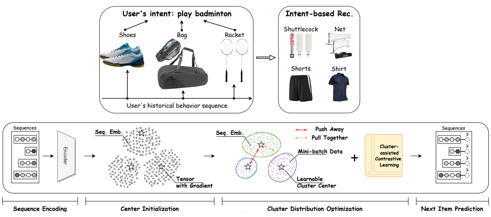
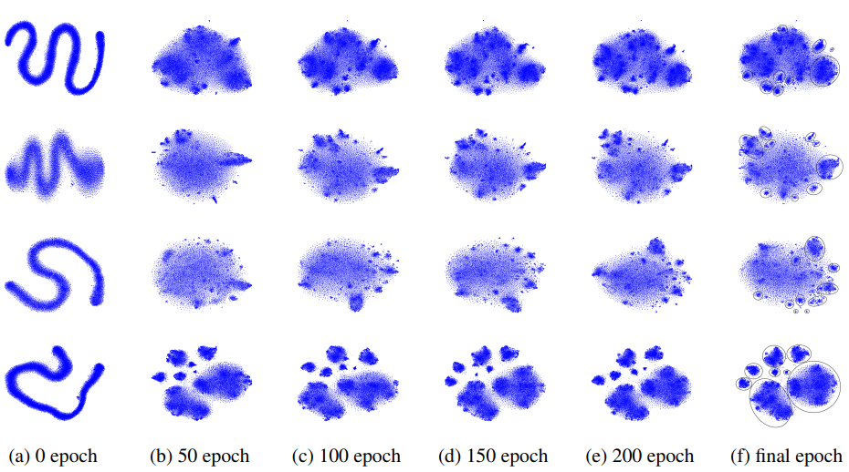

<div align="center">
<h2><a href="https://arxiv.org/pdf/2401.05975">End-to-end Learnable Clustering for Intent Learning in Recommendation</a></h2>

[Yue Liu](https://yueliu1999.github.io/), Shihao Zhu, [Jun Xia](https://junxia97.github.io/), [Yingwei Ma](https://yingweima2022.github.io/), Jian Ma, [Xinwang Liu](https://xinwangliu.github.io/), Shengju Yu, Kejun Zhang, Wenliang Zhong


<p align="center">  <a href="https://pytorch.org/" alt="PyTorch">
  </a> <a href="https://icml.cc/Conferences/2023" alt="Conference">  </a>
</p>


</div>

<p align = "justify">
Intent learning, which aims to learn users' intents for user understanding and item recommendation, has become a hot research spot in recent years. However, existing methods suffer from complex and cumbersome alternating optimization, limiting performance and scalability. To this end, we propose a novel intent learning method termed <u>ELCRec</u>, by unifying behavior representation learning into an <u>E</u>nd-to-end <u>L</u>earnable <u>C</u>lustering framework, for effective and efficient <u>Rec</u>ommendation. Concretely, we encode user behavior sequences and initialize the cluster centers (latent intents) as learnable neurons. Then, we design a novel learnable clustering module to separate different cluster centers, thus decoupling users' complex intents. Meanwhile, it guides the network to learn intents from behaviors by forcing behavior embeddings close to cluster centers. This allows simultaneous optimization of recommendation and clustering via mini-batch data. Moreover, we propose intent-assisted contrastive learning by using cluster centers as self-supervision signals, further enhancing mutual promotion Experimental results demonstrate the superiority of ELCRec from six perspectives. Compared to the runner-up, ELCRec improves NDCG@5 by 8.9% and reduces computational costs by 22.5% on the Beauty dataset. Due to the scalability and universal applicability, we deploy ELCRec on the industrial recommendation system with 130 million page views and achieve promising results.
</p>


<p align="center">
Figure 1. Intent learning in recommendation & ELCRec framework.
</p>


<details>
  <summary>Table of Contents</summary>
  <ol>
    <li><a href="#Usage">Usage</a></li>
    <li><a href="#Result">Result</a></li>
    <li><a href="#Acknowledgement">Acknowledgement</a></li>
    <li><a href="#Citation">Citation</a></li>
  </ol>
</details>


## Usage


### Requirements
- python == 3.12.2
- faiss==1.8.0
- numpy==2.2.1
- scipy==1.14.1
- torch==2.4.1
- tqdm==4.66.4
- wandb==0.19.1

### Quick Start

clone this repository and change directory to ./src

```
git clone https://github.com/yueliu1999/ELCRec.git
cd ./src
```

evaluation on trained model:

```
bash ./scripts/run_sports.sh

ELCRec-Sports_and_Outdoors-1
{'Epoch': 0, 'HIT@5': '0.0286', 'NDCG@5': '0.0185', 'HIT@20': '0.0648', 'NDCG@20': '0.0286'}
```


```
bash ./scripts/run_beauty.sh

ELCRec-Beauty-1
{'Epoch': 0, 'HIT@5': '0.0529', 'NDCG@5': '0.0355', 'HIT@20': '0.1079', 'NDCG@20': '0.0509'}
```


```
bash ./scripts/run_toys.sh

ELCRec-Toys_and_Games-1
{'Epoch': 0, 'HIT@5': '0.0585', 'NDCG@5': '0.0403', 'HIT@20': '0.1138', 'NDCG@20': '0.0560'}
```


```
bash ./scripts/run_yelp.sh

ELCRec-Yelp-1
{'Epoch': 0, 'HIT@5': '0.0236', 'NDCG@5': '0.0150', 'HIT@20': '0.0653', 'NDCG@20': '0.0266'}
```

re-train the model and evaluate:

```
python3 main.py --data_name Beauty --cf_weight 0.1 \
--model_idx 1 --gpu_id 0 \
--batch_size 256 --contrast_type Hybrid \
--num_intent_cluster 256 --seq_representation_type mean \
--intent_cf_weight 0.1 --num_hidden_layers 1
```

```
python3 main.py --data_name Sports_and_Outdoors --cf_weight 0.1 \
--model_idx 1 --gpu_id 0 \
--batch_size 256 --contrast_type Hybrid \
--num_intent_cluster 256 --seq_representation_type mean \
--intent_cf_weight 0.1 --num_hidden_layers 2
```

```
python3 main.py --data_name Toys_and_Games --cf_weight 0.1 \
--model_idx 1 --gpu_id 0 \
--batch_size 256 --contrast_type Hybrid \
--num_intent_cluster 256 --seq_representation_type mean \
--intent_cf_weight 0.1 --num_hidden_layers 3
```

```
python3 main.py --data_name Yelp --cf_weight 0.1 \
--model_idx 1 --gpu_id 0 \
--batch_size 256 --contrast_type Hybrid \
--num_intent_cluster 256 --seq_representation_type mean \
--intent_cf_weight 0.1 --num_hidden_layers 2
```

## Result



## Acknowledgement
Our code are partly based on the following GitHub repository. Thanks for their awesome works.
- [SASRec](https://github.com/kang205/SASRec): the official implement of SASRec model.
- [ICLRec](https://github.com/salesforce/ICLRec): the official implement of ICLRec model.
- [Dink-Net](https://github.com/yueliu1999/Dink-Net): the official implement of Dink-Net model.

## Citation
If you find this repository helpful, please cite our papers.

```
@inproceedings{ELCRec,
  title={End-to-end Learnable Clustering for Intent Learning in Recommendation},
  author={Liu, Yue and Zhu, Shihao and Xia, Jun and Ma, Yingwei and Ma, Jian and Zhong, Wenliang and Liu, Xinwang and Yu, Shengju and Zhang, Kejun},
  booktitle={Proc. of NeurIPS},
  year={2024}
}

@inproceedings{Dink-Net,
  title={Dink-Net: Neural Clustering on Large Graphs},
  author={Liu, Yue and Liang, Ke and Xia, Jun and Zhou, Sihang and Yang, Xihong and Liu, Xinwang and Li, Stan Z.},
  booktitle={International Conference on Machine Learning},
  year={2023},
  organization={PMLR}
}
```

<p align="right">(<a href="#top">back to top</a>)</p>